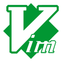

 Hi there 👋

I'm Lebogang, a  creative communicator and full-stack developer.

<h4 align="center">
🌱 building: <a href="https://github.com/lebogangolifant/task_tracker">Task Tracker</a> | 💬 connect: <a href="https://www.linkedin.com/in/lebogangolifant">lebogangolifant</a> 
</h4>

🖥️ Portfolio: <a href="https://lebogang.github.io/">https://lebogang.github.io</a>

 
<h3 align="center"> Tech Stacks and Tools:<h3/>

 

 

<!--
**lebogangolifant/lebogangolifant** is a ✨ _special_ ✨ repository because its `README.md` (this file) appears on your GitHub profile.

Here are some ideas to get you started:

- 🔭 I’m currently working on ...
- 🌱 I’m currently learning ...
- 👯 I’m looking to collaborate on ...
- 🤔 I’m looking for help with ...
- 💬 Ask me about ...
- 📫 How to reach me: ...
- 😄 Pronouns: ...
- ⚡ Fun fact: ...
-->
